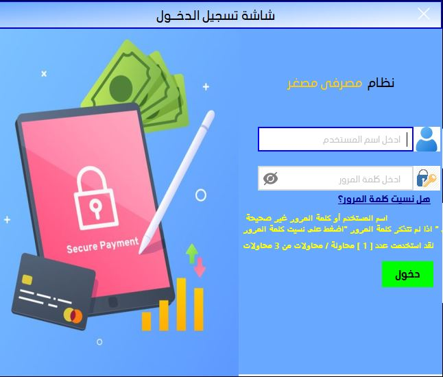
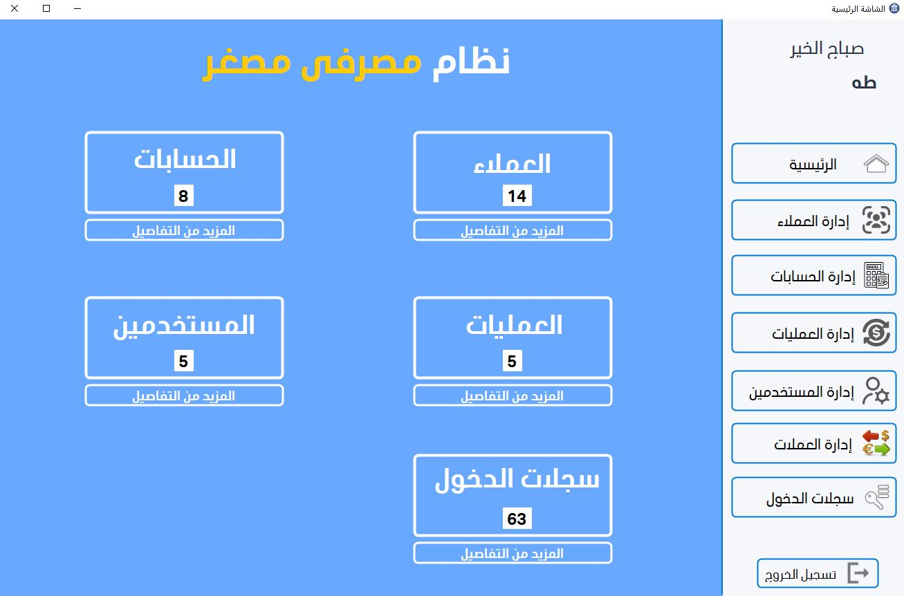
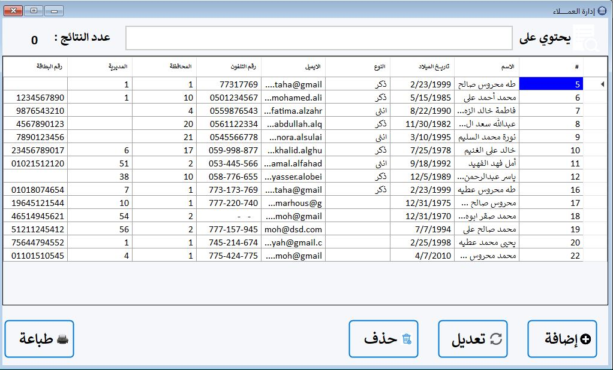
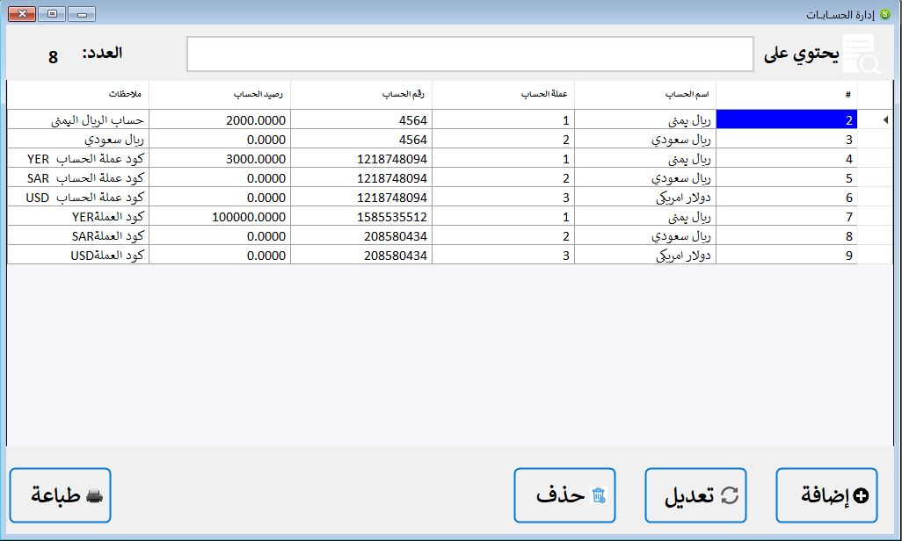

---

# 🏦 Banking System (C# .NET WinForms) 💳

A secure and robust **Windows Forms banking management system** built with a multi-layer architecture. It features comprehensive client and account management, transaction processing, user permissions, and detailed audit logging, all through an intuitive graphical interface.

---

## 📘 Project Overview

This system provides a complete internal banking solution with:

*   **👥 Role-Based Authentication:** Secure login with permission controls.
*   **👤 Client Management:** Full CRUD operations for managing client information.
*   💳 **Account Management:** Create and manage client accounts in different currencies.
*   **💸 Transaction Processing:** Handle deposits, withdrawals, and transfers.
*   **🌍 Multi-Currency Support:** Manage different currencies and exchange rates.
*   **📊 Audit & Logging:** Track all user logins and system activities (`سجلات الدخول`).

---

## 🛠️ Key Features & Modules

### 🔐 Security & Authentication (`frmLogin`)
*   Secure login form with username and password validation.
*   Attempt limiting (3 tries) with on-screen messages.
*   Hashed password storage for security.
*   Displays informative messages for incorrect credentials and forgotten passwords.

### 🖥️ Main Dashboard (`frmMain`)
*   Clean, modern dashboard providing a system overview.
*   Displays key metrics: Number of Users, Clients, Accounts, and Transactions.
*   Centralized navigation menu to access all system modules.

### 👥 Client Management (`frmClients`, `frmAddEditClient`)
*   View a list of all clients with details (Name, DoB, Gender, Phone, Email, etc.).
*   Add, edit, and delete client records.
*   Search and filter functionality to find clients quickly.

### 💰 Account Management (`frmAccount`, `frmAddEditAccount`)
*   View all accounts with details (Account Number, Balance, Currency, Client Name).
*   Create new accounts linked to specific clients and currencies.
*   Support for holding balances in multiple currencies (YER, SAR, USD).

### 🔄 Transaction Management (`frmTransaction`, `frmAddEditTransactions`)
*   Process financial transactions (Deposit, Withdraw, Transfer).
*   Maintain accurate account balances.
*   Log all transaction details for auditing.

### 👨‍💼 User Management (`frmUsers`, `frmAddEditUser`)
*   Manage system users and assign permissions (visible in dashboard user count).
*   Control who can access different parts of the system.

### 🌐 Currency Management (`frmCurrency`, `frmAddEditCurrency`)
*   Define and manage supported currencies and their exchange rates.
*   Essential for multi-currency account operations.

### 📝 Login Register (`frmLoginRegister`)
*   View a detailed log of all user login attempts and sessions.
*   This is a read-only audit trail, automatically populated by the system.

---

## 🏗️ Technical Architecture

The project follows a professional **Multi-Layer Architecture**:

```
BankSys_WinForms (Solution)
│
├── BankBusinessLayer (Class Library)
│   ├── clsAccount.cs
│   ├── clsClientsBusiness.cs
│   ├── clsCurrency.cs
│   ├── clsLoginRegister.cs
│   ├── clsTransaction.cs
│   └── clsUser.cs
│
├── BankDataAccessLayer (Class Library)
│   ├── clsAccountData.cs
│   ├── clsClientData.cs
│   ├── clsCurrencyData.cs
│   ├── clsLoginRegisterData.cs
│   ├── clsTransactionData.cs
│   └── clsUserData.cs
│
└── BankSys_WinForms (Windows Forms App)
    ├── Forms
    │   ├── Clients/
    │   ├── Accounts/
    │   ├── Currency/
    │   ├── Transactions/
    │   ├── Users/
    │   ├── LoginRegister/
    │   ├── frmLogin.cs
    │   └── frmMain.cs
    │
    ├── clsGlobal.cs
    ├── clsScreen.cs
    └── Program.cs
```

*   **Data Access Layer (DAL):** Handles all communication with the database.
*   **Business Logic Layer (BLL):** Contains the core business rules and operations.
*   **Presentation Layer (WinForms):** Provides the user interface.

---

## 🚀 Getting Started

### Prerequisites
*   **.NET Framework** (Version as per project configuration, e.g., .NET 4.7.2+)
*   **Microsoft Visual Studio** 2019 or 2022
*   A SQL Server database (e.g., SQL Server Express LocalDB, as implied by `App.config`)

### Installation & Setup
1.  Clone or download the project source code.
2.  Open the `BankSys_WinForms.sln` solution file in Visual Studio.
3.  Restore any NuGet packages if prompted.
4.  Check the `App.config` file and ensure the database connection string is correct for your environment.
5.  Build the solution (`Ctrl + Shift + B`).
6.  Run the application (`F5`). The startup form is `frmLogin`.

### Default Login
*   You will need a valid username and password configured in the database to log in. The first user must typically be created directly in the database.

---

## 📸 Application Screenshots

### Login Interface (`frmLogin`)

*Secure login form with validation and attempt tracking.*

### Main Dashboard (`frmMain`)

*Dashboard showing system statistics and navigation menu.*

### Manage Clients (`frmClients`)

*Interface to view, add, edit, and delete bank clients.*

### Manage Accounts (`frmAccount`)

*Interface for managing client accounts and balances.*

---

## 🧑‍💻 Development Notes

*   The code uses structured exception handling for robustness.
*   The `clsGlobal` and `clsScreen` classes likely contain global variables and utility methods for screen handling.
*   The project is built with object-oriented principles, promoting reusability and maintainability.

---

## 📜 License

This project is developed for educational and portfolio purposes. The source code is available for review and learning.

---

## ©️ Copyright

**© 2025 Taha Mahrous. All rights reserved.**

---

## 🔐 Default User Credentials

For initial setup, the application includes a default admin user:

- **Username**: `admin`
- **Password**: `admin`

---
